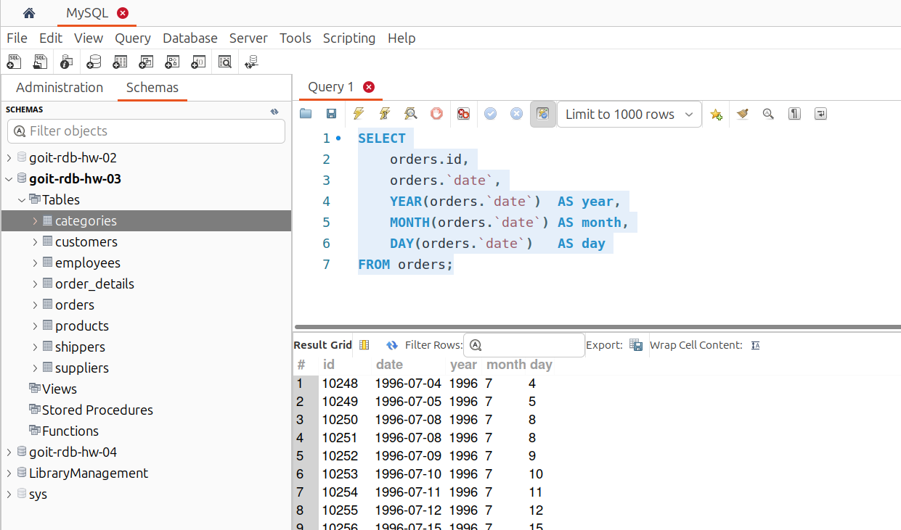
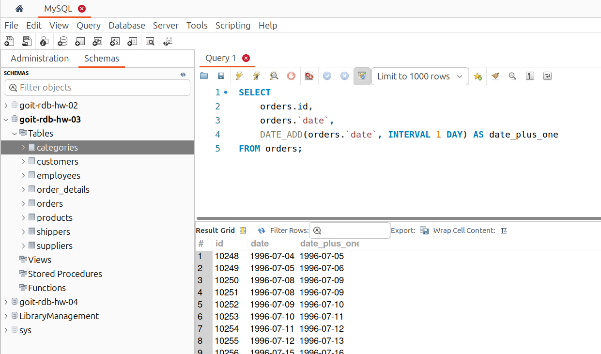
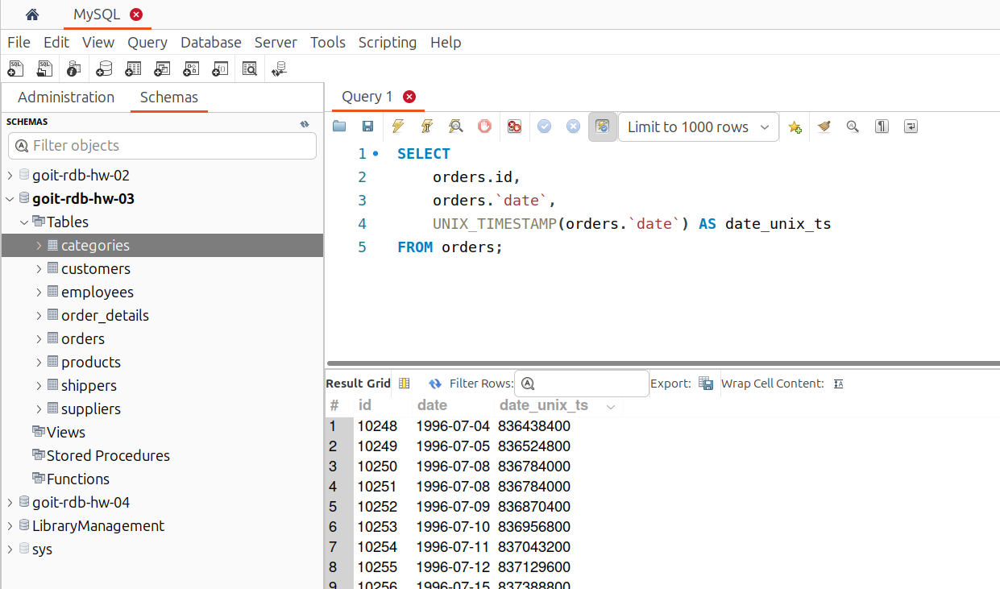
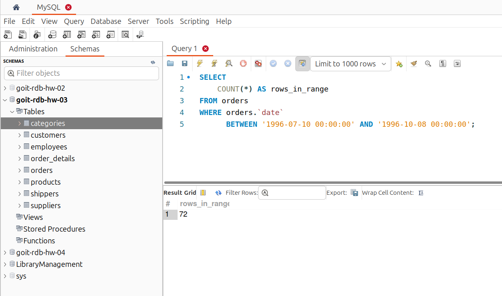
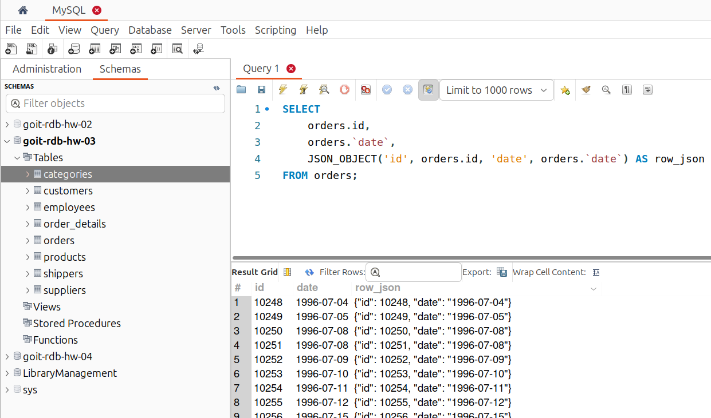

# [Домашнє завдання до Теми 7. Додаткові вбудовані SQL функції. Робота з часом](https://www.edu.goit.global/learn/25315460/21808779/22222335/homework)
## Основні характеристики форматів

### DATETIME

Використовується для зберігання значень у вигляді `YYYY-MM-DD HH:MM:SS`, де:

    - `YYYY` — рік.
    - `MM` — місяць від 01 до 12.
    - `DD` — день місяця від 01 до 31.
    - `HH` — година від 00 до 23.
    - `MM` — хвилина від 00 до 59.
    - `SS` — секунда від 00 до 59.

Підтримує діапазон від `1000-01-01 00:00:00` до `9999-12-31 23:59:59`. `DATETIME` не має інформації про часовий пояс. 
Зазвичай він використовується в локальному часовому поясі сервера.
Значення `DATETIME` може бути збережено у стовпці таблиці, який має тип `DATETIME`.

### TIMESTAMP

Це одне число, що дорівнює кількості секунд (у деяких інших базах даних — мікросекунд), від деякої заздалегідь визначеної реперної точки (точки старту відліку). Ця точка старту — `1970-01-01 00:00:00 UTC`.
Представляє значення у вигляді `YYYY-MM-DD HH:MM:SS`, так само як і `DATETIME`.
Діапазон від `1970-01-01 00:00:01` UTC (час за Гринвічем) до `2038-01-19 03:14:07` UTC. Цей діапазон обумовлений використанням 32-бітного цілого числа для представлення секунд від початку відліку (`1970-01-01 00:00:00 UTC`).

### DATE

Тип даних `DATE` у MySQL використовується для зберігання дати без урахування часу. Дозволяє представляти лише рік, місяць і день.
Зберігає значення у форматі `YYYY-MM-DD`, де `YYYY` — рік (чотиризначне число року від `0000` до `9999`), `MM` — місяць (від `01` до `12`), `DD` — день (від `01` до `31`). Підтримує діапазон від `1000-01-01` до `9999-12-31`.

### YEAR

Тип даних `YEAR` у MySQL використовується для зберігання року у форматі чотирицифрового числа. Зберігає значення у форматі `YYYY`, де `YYYY` — чотирицифрове число року. Підтримує діапазон від `1901` до `2155`.

## Опис домашнього завдання

1. Напишіть SQL-запит, який для таблиці `orders` з атрибута `date` витягує `рік`, `місяць` і `число`. Виведіть на екран їх у три окремі атрибути поряд з атрибутом `id` та оригінальним атрибутом `date` (всього вийде 5 атрибутів).
2. Напишіть SQL-запит, який для таблиці `orders` до атрибута `date` додає один день. На екран виведіть атрибут `id`, оригінальний атрибут `date` та результат додавання.
3. Напишіть SQL-запит, який для таблиці `orders` для атрибута `date` відображає кількість секунд з початку відліку (показує його значення `timestamp`). Для цього потрібно знайти та застосувати необхідну функцію. На екран виведіть атрибут `id`, оригінальний атрибут `date` та результат роботи функції.
4. Напишіть SQL-запит, який рахує, скільки таблиця `orders` містить рядків з атрибутом `date` у межах між `1996-07-10 00:00:00` та `1996-10-08 00:00:00`.
5. Напишіть SQL-запит, який для таблиці `orders` виводить на екран атрибут `id`, атрибут `date` та JSON-об’єкт `{"id": <атрибут id рядка>, "date": <атрибут date рядка>}`. Для створення JSON-об’єкта використайте функцію.

### Критерії прийняття

1. Прикріплені посилання на репозиторій `goit-rdb-hw-07` та безпосередньо самі файли репозиторію архівом.
2. Написано всі 5 запитів відповідно до заданих умов виконання. SQL-запити виконуються й повертають необхідні дані.

## Рішення
### Напишіть SQL-запит, який для таблиці `orders` з атрибута `date` витягує `рік`, `місяць` і `число`. Виведіть на екран їх у три окремі атрибути поряд з атрибутом `id` та оригінальним атрибутом `date` (всього вийде 5 атрибутів).

```sql
SELECT
    orders.id,
    orders.`date`,
    YEAR(orders.`date`)  AS year,
    MONTH(orders.`date`) AS month,
    DAY(orders.`date`)   AS day
FROM orders;
```



### Напишіть SQL-запит, який для таблиці `orders` до атрибута `date` додає один день. На екран виведіть атрибут `id`, оригінальний атрибут `date` та результат додавання

```sql
SELECT
    orders.id,
    orders.`date`,
    DATE_ADD(orders.`date`, INTERVAL 1 DAY) AS date_plus_one
FROM orders;
```



### Напишіть SQL-запит, який для таблиці `orders` для атрибута `date` відображає кількість секунд з початку відліку (показує його значення `timestamp`). Для цього потрібно знайти та застосувати необхідну функцію. На екран виведіть атрибут `id`, оригінальний атрибут `date` та результат роботи функції

```sql
SELECT
    orders.id,
    orders.`date`,
    UNIX_TIMESTAMP(orders.`date`) AS date_unix_ts
FROM orders;
```



### Напишіть SQL-запит, який рахує, скільки таблиця `orders` містить рядків з атрибутом `date` у межах між `1996-07-10 00:00:00` та `1996-10-08 00:00:00`

```sql
SELECT
    COUNT(*) AS rows_in_range
FROM orders
WHERE orders.`date`
      BETWEEN '1996-07-10 00:00:00' AND '1996-10-08 00:00:00';
```



### Напишіть SQL-запит, який для таблиці `orders` виводить на екран атрибут `id`, атрибут `date` та JSON-об’єкт `{"id": <атрибут id рядка>, "date": <атрибут date рядка>}`. Для створення JSON-об’єкта використайте функцію

```sql
SELECT
    orders.id,
    orders.`date`,
    JSON_OBJECT('id', orders.id, 'date', orders.`date`) AS row_json
FROM orders;
```




### Репозиторій
[goit-rdb-hw-07](https://github.com/nickolas-z/goit-rdb-hw-07)
